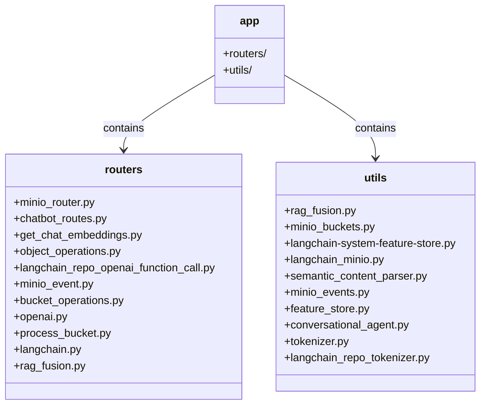

# cda.langchain-system

The Langchain-System, developed by David Cannan, is a state-of-the-art application designed to integrate LangChain with MinIO's Object Lambda. Designed with an eye for detail and scalability, this application stands at the forefront of data manipulation and AI-powered interactions, making it a versatile tool in modern tech ecosystems.

[Cdaprod/cda.langchain-system](https://github.com/Cdaprod/cda.langchain-system)

---


## Overview
The `cda.langchain-system`, a brainchild of David Cannan, represents a pinnacle in

### Expanded Capabilities and Applications
- **Sophisticated Data Processing & Transformation**: Harnessing the power of MinIO Lambda and FastAPI, the system excels in real-time, on-demand data transformation. This is pivotal in scenarios like live data feeds, complex ETL pipelines, and responsive data analytics platforms.
- **Advanced Conversational AI**: The fusion of chatbot functionalities with OpenAI's cutting-edge technologies enables the creation of intelligent and nuanced conversational agents. This can revolutionize customer service interfaces, create engaging interactive experiences, and provide support in AI-driven tutoring systems.
- **Event-Driven Data Dynamics**: With its intrinsic capability to react to MinIO events, the system is perfectly poised for applications requiring instantaneous data responsiveness, such as IoT systems, live monitoring dashboards, and event-based triggers in workflow automation.
- **Deep Semantic Analysis & Content Parsing**: Leveraging sophisticated content parsing, the system is adept at understanding and interpreting complex textual data. This finds its use in advanced content curation, semantic search engines, and insightful text analytics solutions.
- **Comprehensive API Ecosystem**: The broad spectrum of API integrations and management through FastAPI positions the system as an ideal backbone for creating microservices architectures, scalable backend solutions, and as an integration layer in multi-platform ecosystems.

### Features
- **Modular Structure**: Organized into distinct components for clarity and maintainability.
- **MinIO Integration**: Leverages MinIO Object Lambda for on-demand data transformation.
- **FastAPI Based Routers**: Efficient API development with asynchronous handling.
- **Comprehensive Utilities**: Includes tokenization, feature store, and MinIO event handling.

## Repository Structure



## Detailed Installation and Usage
1. **Setup**: Detailed instructions on cloning the repository, environment setup, and dependency management.
2. **Execution**: Step-by-step guide on running the system with `uvicorn`, including configuration options and optimization tips.
3. **API Interaction**: In-depth documentation on interacting with the API, complete with examples and use case scenarios.

### Setup

#### Installation
1. Clone the repository:
   ```bash
   git clone https://github.com/Cdaprod/cda.langchain-system.git
   ```
2. Install dependencies:
   ```bash
   pip install -r requirements.txt
   ```

#### Usage
Navigate to the `langchain-system` directory and run the application:
```bash
uvicorn app.main:app --reload
```
Access the API at `http://localhost:8000`.

---


#### Extensive Contribution Guidelines
Dedicated to collaborative growth, we encourage contributions. Detailed guidelines provide insight into coding standards, pull request procedures, and issue reporting.

#### Contact and Collaboration
- **Developer**: David Cannan - a visionary in system integration and AI applications.
- **GitHub**: [Cdaprod](https://github.com/Cdaprod) - Explore, fork, and contribute.

#### Special Acknowledgments
Heartfelt thanks to the vibrant community of developers, testers, and visionaries who have contributed to the evolution of this project.

### License
The Langchain-System is open-sourced under the [MIT License](https://opensource.org/licenses/MIT).

This README provides a comprehensive guide to the Langchain-System, detailing its setup, usage, and contribution guidelines. For more information, please refer to the respective files and documentation within the repository.