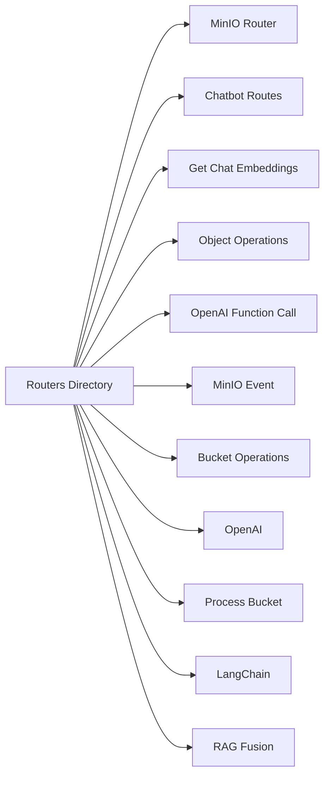

### README.md for `routers` Directory

#### Overview
The `routers` directory in the `cda.langchain-system` project consists of various router modules, each serving specific functionalities within the FastAPI framework. These routers handle tasks ranging from MinIO operations to chatbot interactions and OpenAI integration.

#### Files and Their Purposes

1. **minio_router.py**: Manages routes for MinIO operations.
2. **chatbot_routes.py**: Handles chatbot interaction endpoints.
3. **get_chat_embeddings.py**: Retrieves chat embeddings from MinIO.
4. **object_operations.py**: API routes for object management in MinIO.
5. **langchain_repo_openai_function_call.py**: Facilitates OpenAI API interactions.
6. **minio_event.py**: Handles MinIO event notifications.
7. **bucket_operations.py**: Manages MinIO bucket-related operations.
8. **openai.py**: Integrates OpenAI functionalities for text generation.
9. **process_bucket.py**: Processes data within MinIO buckets.
10. **langchain.py**: Provides LangChain-specific processing routes.
11. **rag_fusion.py**: Incorporates RAG fusion methods into the system.

These modules collectively enhance the system's ability to interact with external APIs, manage data, and provide dynamic responses in various application scenarios.