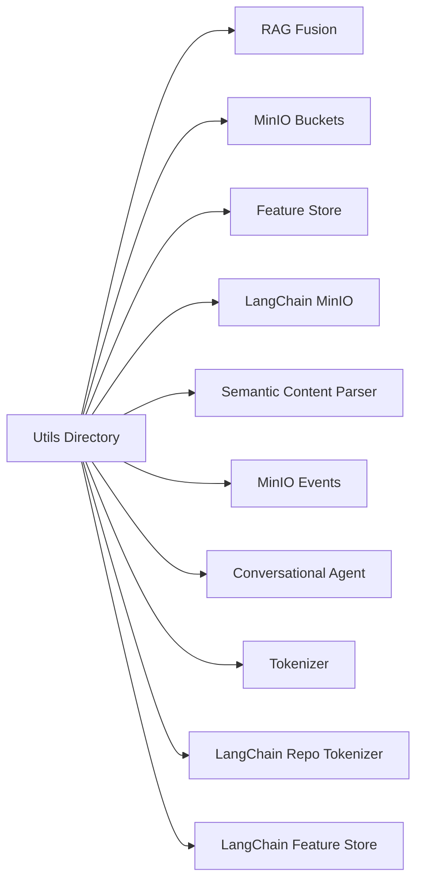

### README for `utils` Directory

#### Overview
The `utils` directory contains utility modules supporting various functionalities in the `cda.langchain-system` project. These utilities are integral for data processing, API interactions, MinIO operations, and conversational AI.

#### Files and Their Functions

1. **rag_fusion.py**: Integrates Weaviate and OpenAI for advanced query generation.
2. **minio_buckets.py**: Manages MinIO bucket creation and interactions.
3. **langchain-system-feature-store.py**: Validates Python source code and handles syntax checking.
4. **langchain_minio.py**: Provides routes for processing data with MinIO Lambda functions.
5. **semantic_content_parser.py**: Parses and processes semantic content.
6. **minio_events.py**: Sets up event listeners for MinIO buckets.
7. **feature_store.py**: A class for managing features in a store.
8. **conversational_agent.py**: Implements a conversational agent using OpenAI.
9. **tokenizer.py** & **langchain_repo_tokenizer.py**: Handle text tokenization and processing for LangChain repositories.

These utilities enhance the application's capabilities in handling complex data processing, storage operations, and AI-powered interactions.